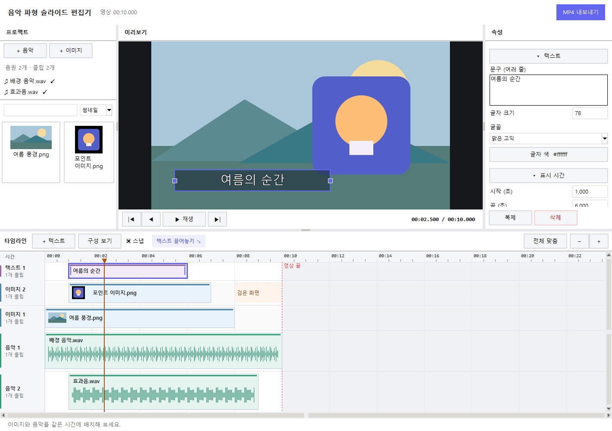
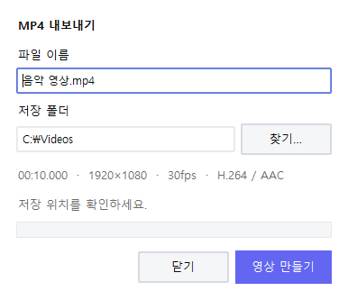

# 선율담

선율담은 음악·사진·영상·문구를 배치해 **MP4 영상**을 만드는 Windows 프로그램입니다. 파형을 보며 표시 시간을 맞출 수 있고, 사진·영상·음원을 같은 시간에 여러 개 겹쳐 놓을 수도 있습니다. 작업은 모두 내 PC에서 처리합니다.

**Windows용 다운로드:** [Google Drive에서 열기](https://drive.google.com/file/d/1wpl91SbwGffeCzujPD6Aezt0pU2hdmXb/view?usp=drive_link) · [웹 소개 페이지 소스](dist/index.html)


현재 소스에는 **Studio 디자인**이 적용돼 있습니다. 밝은 회색 작업면과 흰색 패널, 보라색 선택 표시를 사용하며 상단에는 프로젝트 이름과 저장 상태를 보여줍니다. 버튼과 메뉴는 테두리·배경으로 클릭 영역을 표시하고, 오른쪽 클립 속성에는 넓은 스크롤바와 숨겨진 내용의 스크롤 방향 안내를 제공합니다. 클립 속성은 시간·화면 배치·소리·전환 항목으로 구분됩니다. 위 화면은 이전 디자인의 샘플 예시이며, 기존 다운로드 파일에도 이전 디자인과 기능이 남아 있을 수 있습니다.

**2026-10-05 작업본:** 타임라인 복사·붙여넣기, 음악을 포함한 미디어 검색·필터·스크롤, 등록 미디어 삭제와 실행 취소를 지원합니다. 음악을 가져와도 기존 필터·검색·표시 설정을 유지합니다. 반복 영상은 같은 구간의 인코딩 결과를 재사용하며, 많은 미디어를 처리할 때 디코더·파형·이미지 캐시·오디오 파일 핸들의 사용량을 제한합니다. 최신 코드의 전체 70개 회귀 테스트와 새 EXE의 MP4 생성 검증 결과는 [검증 기록](VALIDATION.md)에서 확인할 수 있습니다.

## 무엇을 할 수 있나요?

- FLAC·WAV·MP3 음원을 여러 개 올려 함께 재생할 수 있습니다. 소리가 겹치면 하나로 섞이고, 음원이 없는 구간은 무음으로 남습니다.
- MP4·MOV·MKV·WebM 영상을 가져와 원본의 필요한 구간을 자르고, 이미지·영상과 겹쳐 배치할 수 있습니다. 음악 없이 영상만 재생·출력할 수도 있습니다. 실제 입력 코덱 지원은 포함된 FFmpeg에 따라 달라집니다.
- JPG·JPEG·PNG 사진을 겹쳐 놓고 앞뒤 순서와 위치, 크기, 움직임을 조절할 수 있습니다. 사진과 영상이 모두 없는 구간은 검게 나옵니다.
- 사진 위에 여러 줄 문구를 넣고 글꼴·색상·정렬·외곽선·반투명 배경을 설정할 수 있습니다.
- 사진이 이어지는 곳에는 **즉시 전환·크로스 디졸브·검정 페이드·좌우 슬라이드**를 넣을 수 있습니다.
- 음악·사진·영상·문구 클립을 복사해 재생 위치에 붙여넣을 수 있습니다. 원본 사용 구간과 반복·움직임·소리 설정을 유지하며 복사본을 별도로 편집합니다.
- 미디어 목록에서 음악·사진·영상을 검색하고, 사용하지 않을 파일은 연결된 클립과 함께 제거할 수 있습니다. 원본 파일은 유지하며 실행 취소로 복원합니다.
- 완성한 영상은 **1920×1080, 30fps, H.264 영상과 AAC 오디오** 형식의 MP4로 저장됩니다.

화면 구성이나 프로젝트 저장 방식이 궁금하다면 [프로그램 상세 가이드](docs/프로그램_상세_가이드.md)를 보세요. 음악 분석과 MP4 출력 과정도 설명해 두었습니다.

## 시작하기

Windows용 배포 파일은 위의 Google Drive 링크에서 받을 수 있습니다. 소스로 실행할 때는 **Python 3.10 이상**, Tkinter, FFmpeg, FFprobe가 필요합니다. FFmpeg와 FFprobe는 `PATH`에 등록하거나 프로젝트의 `ffmpeg/bin`에 넣으세요.

```powershell
python -m pip install -r requirements.txt
python seonyuldam.py
```

예전 실행 명령인 `python music_to_video.py`와 해당 모듈 가져오기도 계속 지원합니다.

Python 없이 실행할 폴더를 직접 만들려면 아래 [배포 폴더 만들기](#배포-폴더-만들기)를 참고하세요.

## 3단계로 영상 만들기

### 영상 파일 사용하기

왼쪽 **미디어 가져오기 > 영상 가져오기**에서 파일을 선택하세요. 가져오는 동안 미디어 목록과 하단에 **진행률(%)과 처리 단계**가 표시됩니다. 여러 파일을 가져오면 목록에서 파일별 진행률을 확인할 수 있습니다. 진행률은 미리보기 생성·소리 추출·파형 분석의 실제 처리량을 단계별로 합산한 값이며 남은 시간의 비율은 아닙니다. 저해상도 미리보기 준비가 끝나면 썸네일과 길이가 표시됩니다. 준비 중에는 작업 취소가 가능하며, 준비가 실패하거나 취소됐다면 해당 영상을 선택하고 **선택 미디어 추가**를 눌러 다시 준비할 수 있습니다. 파일 가져오기는 타임라인을 자동으로 바꾸지 않습니다.

준비된 영상을 이미지 트랙에 끌어 놓거나 **선택 미디어 추가**를 누르세요. 영상이 배치되면 트랙 이름은 **화면**으로 바뀝니다. 타임라인의 **이어 붙이기 > 영상 모두 이어 붙이기**는 아직 사용하지 않은 영상을 기존 이미지·영상 끝부터 순서대로 배치합니다.

영상 가운데를 끌면 타임라인 위치를 옮깁니다. 양끝을 끌어 길이를 늘리면 선택한 원본 구간이 반복됩니다. 반복 중인 클립을 줄이면 남은 길이만 재생하며, 마지막 반복은 중간에 끝날 수 있습니다. 반복 전 클립을 줄일 때는 기존처럼 원본 사용 구간을 자릅니다. 오른쪽 **원본 시작 / 원본 끝**에서 반복할 구간을 고르고, **타임라인 끝 (초)**으로 재생 길이를 직접 정할 수도 있습니다. 이미지와 동일하게 미리보기에서 위치·크기를 조절하고 앞뒤 순서를 바꿀 수 있습니다.

**루프 횟수**에 1 이상의 정수를 입력하고 **횟수 적용**을 누르거나 Enter를 누르면 선택한 원본 구간의 길이 × 횟수로 클립 길이를 정합니다. 1회는 한 번 재생, 3회는 총 세 번 재생입니다. 예를 들어 원본 5~15초 구간을 3회로 설정하면 30초 동안 재생됩니다. 직접 늘린 길이에서는 마지막 부분 재생도 횟수에 포함해 표시합니다. 횟수를 적용하면 원본 시작부터 다시 재생하며, 원본 구간을 바꾸면 같은 반복 비율로 길이도 바뀝니다.

영상의 **원본 소리는 기본으로 꺼져 있습니다**. 오른쪽에서 **원본 소리 켜기**를 선택하면 배경 음악과 함께 재생·출력됩니다. 음량은 0~200%이며, 페이드 인·아웃도 설정할 수 있습니다. 소리 없는 영상은 해당 체크박스가 비활성화됩니다. 영상 이동·자르기·복제·삭제에 원본 소리가 함께 따라갑니다. 영상을 늘리면 소리도 같은 원본 구간을 반복합니다. 페이드는 각 반복이 아닌 전체 클립의 시작과 끝에 적용됩니다.

전체 길이는 **음악과 영상 중 가장 늦은 종료 시각**으로 정합니다. 화면이 없는 구간은 검게, 소리가 없는 구간은 무음으로 출력합니다. 미리보기는 최대 960×540의 프록시를 사용하고 MP4 출력은 원본을 디코딩합니다. 입력 영상은 타임스탬프 기준으로 30fps에 맞추며, 세로 영상의 회전 정보도 반영합니다.

반복 영상은 문구·이미지·배치가 같은 구간에서 한 주기만 인코딩한 뒤 임시 MP4를 재사용합니다. 영상이 겹치면 모든 영상이 함께 반복되는 주기를 기준으로 하며, 움직임·전환 중에는 각 프레임을 처리합니다. 마지막 부분 반복과 원본 소리의 음량·페이드는 유지됩니다. 디코딩한 전체 영상을 메모리에 저장하지 않으며, 확대 화면은 보이는 영역만 생성합니다. 영상 출력에는 메모리 사용을 줄이는 인코딩 설정을 사용하므로 이전 버전과 파일 크기·압축 결과가 달라질 수 있습니다.

영상·음원 가져오기는 한 파일씩 처리해 여러 파일의 디코더가 동시에 실행되지 않도록 합니다. 파형은 파일당 최대 60,000개의 float32 값(약 240KB)으로 보관하며 긴 음원의 파형 표시만 간격이 넓어집니다. 소리는 원래 48kHz PCM으로 처리합니다. 출력용 이미지·문구 캐시는 32MiB, 오디오 파일 핸들은 8개로 제한합니다. 원본 이미지 크기와 디코더 버퍼 등은 별도 메모리를 사용하므로 이 값이 프로그램 전체 메모리 한도는 아닙니다.

동시에 보이는 영상이 3개 이상이면 최대 2초 단위의 무손실 중간 파일로 합성해 원본 디코더를 최대 2개만 엽니다. 이 경우 메모리는 줄지만 처리 시간과 임시 디스크 사용이 늘어날 수 있습니다. 중간 파일은 해당 구간의 처리 후 삭제하며 실패·취소 시에도 정리합니다. 화면 전체를 가리는 정지 영상 아래의 화면은 디코딩을 생략합니다.

배속·역재생·영상 간 전환은 아직 지원하지 않습니다. 기존 이미지 전환은 계속 지원합니다. 영상이 길거나 고해상도이면 처음 준비와 내보내기에 시간이 걸릴 수 있습니다. 원본의 뒤쪽 구간을 출력할 때도 프레임 선택을 일치시키기 위해 앞부분부터 디코딩할 수 있습니다.

### 1. 음원과 이미지를 등록하고 타임라인에 놓기

왼쪽에서 **미디어 가져오기 > 음악 가져오기**를 눌러 음원을 고르세요. 가져오기 전의 필터·검색·표시 방식은 유지됩니다. 등록한 곡을 확인하려면 **음악** 또는 **전체** 필터를 선택하세요. 여러 곡은 목록의 스크롤바나 마우스 휠로 확인할 수 있고, 파일 이름으로 검색할 수도 있습니다. **전체** 필터에서는 음악·사진·영상을 함께 볼 수 있습니다. 분석이 끝나면 파일 이름 옆에 ✓가 붙고 첫 음원이 0초에 놓입니다. 음원을 더 넣으려면 왼쪽 목록에서 아래 **음악 트랙**으로 끌어 놓거나 곡을 고른 뒤 **선택 미디어 추가**를 누르세요.

등록한 미디어를 제거하려면 왼쪽 목록에서 파일을 고른 뒤 하단 **삭제**, `Delete` 키 또는 우클릭 메뉴의 **미디어 삭제**를 사용하세요. 해당 파일을 사용하는 타임라인 클립도 함께 제거되며 `Ctrl+Z`로 미디어와 클립을 복원할 수 있습니다. 분석 중인 파일을 삭제하면 해당 작업만 취소하고, 대기 중인 파일은 디코딩을 시작하지 않습니다. 다른 파일의 가져오기는 계속됩니다. 원본 파일은 삭제하지 않습니다.

**미디어 가져오기 > 이미지 가져오기**로 사진을 등록한 뒤 **이미지 트랙**에 끌어 놓으세요. 사진을 고르고 **선택 미디어 추가**를 눌러도 됩니다. 기본 표시 시간은 5초이고, 영상 끝을 넘으면 그 지점에서 잘립니다. 같은 시간에 사진을 놓아도 기존 사진은 지워지지 않습니다.

여러 파일을 한 번에 배치하려면 타임라인의 **이어 붙이기** 메뉴에서 **음악 모두 이어 붙이기** 또는 **이미지 모두 이어 붙이기**를 누르세요. 아직 배치하지 않은 파일을 등록 순서대로 추가합니다. 음악은 기존 음악의 끝부터 이어지고, 이미지는 마지막 이미지 이후 남은 영상 구간을 같은 길이로 나누어 표시합니다. 음악 분석이 끝나야 음악을 배치할 수 있으며, 이미지에 사용할 시간이 부족하면 음악이나 영상을 먼저 배치하세요. 한 번의 실행 취소로 일괄 배치를 되돌릴 수 있습니다.

새 음악 클립에는 기본 **1초 페이드 인·아웃**이 적용됩니다. 음악 클립을 선택하고 오른쪽의 **페이드 인 (초) / 페이드 아웃 (초)**를 바꾸세요. 0초는 페이드를 끄며, 짧은 클립에서는 클립 길이까지만 적용합니다. 서로 겹친 음악은 페이드가 적용된 소리를 함께 재생합니다. 페이드 설정은 프로젝트에 저장되고 미리듣기와 MP4 출력에 동일하게 반영됩니다. 기존 프로젝트의 음악 클립은 속성에서 페이드 시간을 지정할 수 있습니다.

### 2. 클립의 시간과 화면을 편집하기

클립은 **가운데를 끌어 옮기고**, **양끝을 끌어 길이를 조절**합니다. 사진과 영상을 같은 시간에 여러 개 놓으면 타임라인에 행이 생기고 화면에도 앞뒤로 겹칩니다. 사진의 순서는 오른쪽 **움직임과 레이어 > 뒤로 / 앞으로**, 영상은 **뒤로 보내기 / 앞으로 가져오기**에서 바꿀 수 있습니다. 음원도 겹쳐 놓으면 함께 재생됩니다. 합친 소리가 출력 범위를 넘으면 그 범위로 제한하며, 전체 길이는 가장 늦게 끝나는 음악 또는 영상을 기준으로 정합니다.

문구를 넣으려면 타임라인의 **＋ 문구**를 누르거나 **문구 드래그 ↘**를 텍스트 트랙으로 끌어 놓으세요. 오른쪽에서 내용을 입력한 뒤 다른 곳을 클릭하거나 저장·내보내기를 시작하면 반영됩니다. `Enter`는 줄바꿈, `Ctrl+Enter`는 즉시 적용입니다.



사진 클립을 고르면 오른쪽에서 시작·끝 시각과 위치·배율, 움직임, 전환 효과를 바꿀 수 있습니다. 미리보기에서 사진을 끌어 위치를 옮기고, 모서리 핸들이나 `Alt+휠`로 크기를 조절하세요. 문구도 미리보기에서 옮기거나 양쪽 핸들로 상자 너비를 바꿀 수 있습니다. 전환 효과는 앞 사진과 빈틈없이 이어질 때 적용됩니다.

타임라인의 **구성 보기**를 열면 음악·사진·문구가 시간순으로 보입니다. 여기서 클립을 선택해 이동·복제·삭제할 수 있고, 검은 화면이나 무음 구간, 영상 끝을 넘어가는 클립도 확인할 수 있습니다.

선택한 클립을 다른 위치에 다시 쓰려면 `Ctrl+C`로 복사하고 재생 위치를 옮긴 뒤 `Ctrl+V`로 붙여넣으세요. **편집 > 복사 / 붙여넣기** 또는 타임라인 우클릭 메뉴도 사용할 수 있습니다. `Ctrl+D`는 선택한 클립의 바로 뒤에 복제합니다. 타임라인에서 `Delete`를 누르면 선택한 클립만 제거하고, 왼쪽 미디어 목록에서 누르면 원본 등록 항목과 연결된 클립을 함께 제거합니다.

### 3. MP4 내보내기

오른쪽 위 **MP4 내보내기**에서 파일 이름과 저장 폴더를 정하고 **영상 만들기**를 누르세요. 만드는 동안 진행률을 확인하거나 작업을 취소할 수 있습니다. 끝나면 영상 길이·파일 크기·저장 경로를 보여주고, 파일이나 폴더를 바로 열 수도 있습니다. 저장 경로 복사도 지원합니다. 같은 이름의 파일은 자동으로 덮어쓰지 않습니다.



## 타임라인 조작 요약

| 동작 | 방법 |
| --- | --- |
| 원하는 시각으로 이동 | 시간 눈금이나 파형 클릭, 재생 헤드 드래그 |
| 클립 이동·길이 변경 | 클립 본체 또는 양끝 드래그. 매우 짧은 클립은 `Shift`를 누르고 끌어 이동 |
| 이미지·음악 겹쳐 놓기 | 같은 종류의 트랙에 드롭하거나 클립을 같은 시간대로 이동. 겹치면 별도 행에 표시 |
| 이미지 앞뒤 순서 변경 | 이미지 클립 선택 후 오른쪽 속성의 **움직임과 레이어 > 뒤로 / 앞으로** |
| 정확히 붙이기 | **스냅**을 켜면 재생 헤드·클립 경계·0초·영상 끝에 가까워질 때 자동으로 붙음. 드래그 중 `Alt`로 잠시 해제 |
| 빈 구간 확인 | 이미지·음악 트랙의 검은 화면·무음 표시 또는 **구성 보기** |
| 확대·스크롤 | `Ctrl+휠` 확대·축소, `Shift+휠` 가로 스크롤, **전체 맞춤** 버튼 |
| 편집 취소·복제·삭제 | `Ctrl+Z` / `Ctrl+Y`, `Ctrl+D`, `Delete`; 드래그 도중 `Esc` |
| 클립 복사·붙여넣기 | 타임라인 클립 선택 후 `Ctrl+C`, 재생 위치를 정한 뒤 `Ctrl+V`. **편집** 및 타임라인 우클릭 메뉴에서도 사용 가능 |

클립 복사·붙여넣기는 현재 프로젝트의 선택한 음악·사진·영상·문구 클립 하나를 대상으로 합니다. 붙여넣은 클립은 원래 길이와 원본 사용 구간, 움직임·반복·음량·페이드·문구 설정을 유지하며 별도로 편집할 수 있습니다. 붙여넣기는 한 번의 실행 취소로 되돌릴 수 있습니다. 문구나 숫자 입력란을 편집할 때 `Ctrl+C`와 `Ctrl+V`는 입력 내용에 적용됩니다.

편집한 내용은 **파일 > 저장**에서 v3 JSON 프로젝트로 저장하세요. 음악·사진·영상은 프로젝트 파일을 기준으로 상대 경로가 기록됩니다. 나중에 파일을 옮겼다면 프로젝트를 다시 열면서 연결할 수 있습니다. 이전 v1·v2 프로젝트도 열 수 있으며, 처음 저장할 때는 `_v3.json`이라는 이름을 제안합니다. 원본 파일은 건드리지 않습니다. 프록시·오디오 캐시는 프로젝트에 저장하지 않고 필요할 때 다시 만듭니다. v3 프로젝트는 이전 앱에서 열 수 없습니다.

## 출력 및 참고 사항

- MP4 / H.264 / yuv420p / 1920×1080 / 30fps / AAC 기본 320kbps
- 사진 비율 유지, 검은 여백, EXIF 회전 및 투명 PNG 반영
- 기본 글꼴은 Windows의 맑은 고딕. 글꼴을 찾지 못하면 대체 글꼴을 사용하고 화면에 알림
- 긴 이미지 움직임 구간은 프레임마다 계산하므로 정적 영상보다 내보내기에 시간이 더 걸릴 수 있음
- 음원 분석 캐시는 Windows 임시 폴더의 `Seonyuldam_PCM`에 보관되어 같은 파일을 다시 사용할 때 재활용됨. 이전 `MusicToVideo_PCM` 캐시가 있으면 계속 사용
- 영상 프록시·썸네일·원본 소리 캐시는 Windows 임시 폴더의 `Seonyuldam_Video`에 보관. 파일 경로·크기·수정 시각으로 구분하며, 준비 중 생긴 임시 파일은 실패·취소 시 정리

## 배포 폴더 만들기

빌드에 필요한 패키지는 `requirements-build.txt`에 있습니다. PyInstaller와 FFmpeg·FFprobe 실행 파일도 준비해야 합니다. `ffmpeg/bin/ffmpeg.exe`, `ffmpeg/bin/ffprobe.exe`, `ffmpeg/LICENSE`, `ffmpeg/README.txt`를 넣거나 기존 로컬 배포 폴더의 FFmpeg를 사용하세요.

```powershell
python -m pip install -r requirements-build.txt
.\build_windows.bat
```

스크립트는 만든 EXE로 샘플 MP4를 출력하고 규격까지 확인한 뒤 `release/Seonyuldam` 폴더를 만듭니다. 배포할 때는 **폴더 전체**가 필요합니다. FFmpeg 빌드의 GPLv3 고지는 [NOTICE-FFmpeg.txt](NOTICE-FFmpeg.txt), 재생 라이브러리 고지는 `LICENSE-sounddevice.txt`와 `LICENSE-PortAudio.txt`에 있습니다.

개발·변환 검증 기록과 아직 확인하지 못한 환경은 [VALIDATION.md](VALIDATION.md)에 정리했습니다.

## GitHub Pages 소개 페이지

[dist/index.html](dist/index.html)은 화면 이미지와 스타일이 모두 들어 있는 **단일 HTML 파일**입니다. 따로 빌드하거나 이미지를 호스팅할 필요 없이 브라우저에서 열 수 있습니다. 다운로드 버튼은 페이지에 지정한 Google Drive 배포 링크로 연결됩니다.
선율담 배경 음악은 [YouTube 영상](https://youtu.be/Bo8o20NVfHU)을 삽입해 페이지를 열 때 자동 재생을 시도합니다. 브라우저가 소리 있는 자동 재생을 제한하면 방문자가 플레이어에서 재생할 수 있습니다.

### 현재 저장소에서 게시하기

1. [저장소 Pages 설정](https://github.com/lahuman/makeMp4/settings/pages)에서 **Build and deployment → Source → GitHub Actions**를 선택합니다.
2. [Actions](https://github.com/lahuman/makeMp4/actions/workflows/pages.yml)에서 **Deploy GitHub Pages → Run workflow → main**으로 첫 배포를 실행합니다.
3. 배포가 성공하면 [https://lahuman.github.io/makeMp4/](https://lahuman.github.io/makeMp4/)에서 안내 페이지를 확인합니다.

[배포 워크플로](.github/workflows/pages.yml)는 `dist`만 게시합니다. 이후 `main`의 `dist/**` 또는 워크플로가 변경되면 자동으로 배포합니다. Pages를 활성화하기 전 실행이 실패했다면 설정을 마친 후 워크플로를 다시 실행하세요.

### Moon 프로젝트 목록에 등록하기

Moon 블로그의 프로젝트로 등록할 때는 `dist/index.html`의 내용 앞에 아래 Jekyll 머리말을 붙여 `/workspace/Moon/_posts/2026-09-27-music-to-video.html`로 저장합니다. `layout: null`은 안내 페이지 자체의 디자인을 사용하고, `project: true`는 기존 Projects 목록에 자동으로 표시되게 합니다.

```yaml
---
layout: null
title: "선율담"
date: 2026-09-27 00:00:00 +0900
excerpt: "선율담은 음악 파형을 보며 음원·사진·영상·문구를 배치하고 MP4로 저장하는 Windows용 로컬 편집기입니다."
project: true
comments: false
permalink: /music-to-video/
---
```

Moon의 기존 배포 흐름을 사용합니다. 변경 사항을 Moon의 `master`에 푸시하면 기존 Jekyll 워크플로가 빌드하여 게시합니다. 배포 후 안내 페이지 주소는 [https://lahuman.github.io/music-to-video/](https://lahuman.github.io/music-to-video/)이며, [Projects 목록](https://lahuman.github.io/projects/)에도 나타납니다. 안내 페이지를 수정하면 Moon의 해당 HTML 본문도 함께 갱신하세요.
