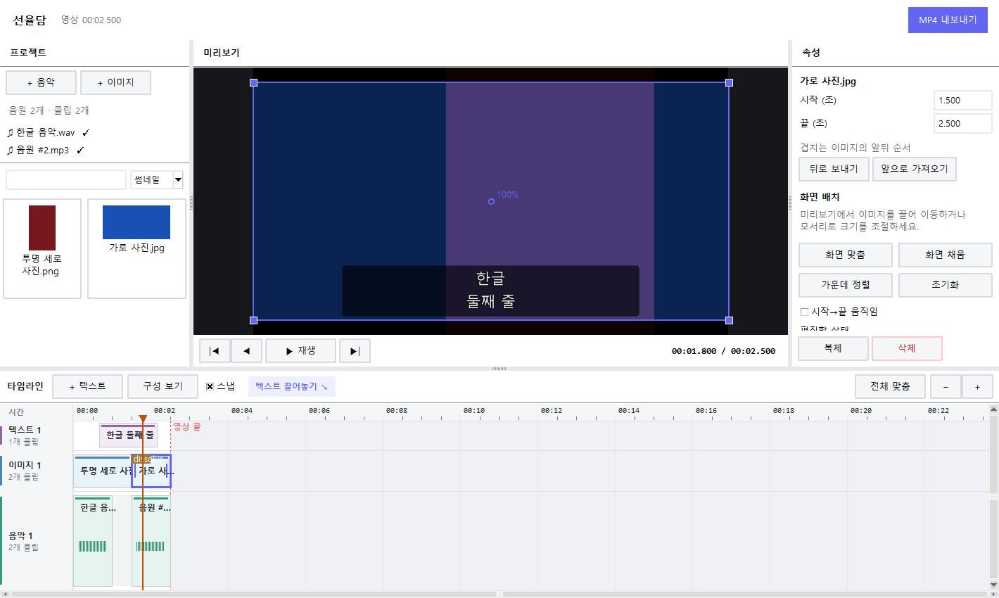

# 선율담 상세 가이드

처음 사용하는 분을 위해 화면 조작부터 저장까지 정리했습니다. 프로그램이 파일을 어떻게 다루는지, 코드가 궁금하다면 어디부터 보면 되는지도 담았습니다. 빠른 사용법은 [README](../README.md)에 있습니다.

2026-10-05 소스 작업본 기준입니다. 기존 화면 예시와 공개 다운로드 파일에는 이후 추가된 기능이 반영되지 않았을 수 있습니다. 실제 검증 범위는 [VALIDATION.md](../VALIDATION.md)에서 확인할 수 있습니다.

## 1. 선율담에서 하는 일

선율담은 음악·사진·영상·문구를 타임라인에 놓아 MP4 영상을 만드는 Windows 편집기입니다. 원본 파일은 그대로 두고, 파일 경로와 편집 내용만 프로젝트(JSON)에 저장합니다. MP4를 만들 때 원본을 읽어 화면과 소리를 합칩니다. 음악 없이 영상만으로 시작할 수도 있습니다.

작업 흐름은 간단합니다.

> 음악·사진·영상을 등록합니다 → 사용할 클립과 문구를 타임라인에 배치합니다 → 미리보기로 확인합니다 → MP4로 저장합니다.

Python과 Tkinter로 만든 데스크톱 앱입니다. 미리보기와 내보낸 영상에는 같은 합성 규칙이 적용됩니다. 가져온 미디어는 서버에 올리지 않고 PC에서 처리합니다.

## 2. 화면 구성

화면은 네 부분으로 나뉩니다.

| 영역 | 하는 일 |
| --- | --- |
| 왼쪽 미디어 | 가져온 음악·사진·영상을 보고 타임라인으로 끌어 놓는 곳 |
| 가운데 미리보기 | 현재 재생 위치의 화면을 보고 사진의 위치와 크기를 조절하는 곳 |
| 오른쪽 클립 속성 | 선택한 사진·영상·문구·음악 클립의 시간과 표시 설정을 바꾸는 곳 |
| 아래 타임라인 | 클립의 시작과 길이, 겹치는 구간을 확인하는 곳 |

패널 사이의 경계를 끌면 크기를 바꿀 수 있습니다. 보기 메뉴에서는 패널을 숨기거나 기본 배치로 되돌릴 수 있습니다. 창 크기와 패널 위치는 프로젝트 내용과 따로 저장됩니다.

Studio 디자인에서는 상단에 프로젝트 이름과 `저장 전`·`수정됨`·`저장됨` 상태가 표시됩니다. 타임라인의 `이어 붙이기` 메뉴에는 이미지·음악·영상의 일괄 배치 명령이 있습니다.

왼쪽 미디어 목록에는 **전체·음악·영상·사진** 필터와 파일 이름 검색, 썸네일/목록 표시가 있습니다. 음악도 같은 스크롤 영역에 표시되므로 여러 곡은 스크롤바나 마우스 휠로 확인하세요. 음악을 가져와도 기존 필터·검색·표시 설정을 유지합니다. 음악 목록이 보이지 않으면 검색 조건을 확인하고 **음악** 또는 **전체** 필터를 선택하세요. 오른쪽 속성의 아래쪽 항목은 자체 스크롤바와 방향 안내를 보고 이동할 수 있습니다.



사진이나 음악이 겹치면 타임라인에 행이 늘어납니다. 사진은 위쪽 행에 놓인 것이 화면 앞에 보이고, 음악은 행이 달라도 함께 재생됩니다. 위 화면은 샘플 파일로 만든 예시입니다.

## 3. 처음부터 MP4를 만드는 순서

### 3.1 음악 등록

왼쪽에서 FLAC, WAV, MP3 파일을 추가하세요. FFprobe가 파일을 읽을 수 있는지와 길이를 확인하고, FFmpeg가 재생과 파형 표시에 쓸 데이터를 준비합니다. 분석이 끝나면 목록에 완료 표시가 붙습니다. 첫 음원은 타임라인 0초에 자동으로 놓입니다.

파형은 구간별 가장 큰 진폭을 그린 것입니다. 짧은 음원에서는 기본 10밀리초 간격을 사용하고, 긴 음원에서는 간격을 늘려 파일당 최대 60,000개 값으로 제한합니다. 표시 간격만 달라지며 재생·출력 소리의 길이와 샘플 정밀도는 유지됩니다. 소리가 어디서 커지고 작아지는지 볼 수 있지만, 음의 높이나 박자를 분석하지는 않습니다.

첫 음원 외의 곡은 목록에서 음악 트랙으로 끌어 놓거나 선택 후 **선택 미디어 추가**를 누르세요. **이어 붙이기 > 음악 모두 이어 붙이기**는 아직 배치하지 않은 곡을 기존 음악 끝부터 등록 순서대로 추가합니다. 새 음악 클립에는 기본 1초 페이드 인·아웃이 적용되며, 오른쪽에서 시간을 바꾸거나 0초로 끌 수 있습니다.

같은 음악을 다시 열면 임시 폴더의 `Seonyuldam_PCM` 캐시를 재사용할 수 있습니다. 이전 `MusicToVideo_PCM` 캐시도 계속 사용합니다. 원본 파일의 경로·크기·수정 시각으로 캐시를 구분하며, 프로젝트에는 캐시 대신 음악 파일 경로와 클립 정보를 저장합니다.

### 3.2 사진 배치

JPG, JPEG, PNG 사진을 등록하고 왼쪽 목록에서 이미지 트랙으로 끌어 놓으세요. 사진을 놓으려면 먼저 음악 또는 영상으로 타임라인 길이를 만들어야 합니다. 기본 표시 시간은 최대 5초이고, 영상 끝을 넘으면 그 지점에서 잘립니다. 선택한 사진을 재생 위치에 놓으려면 **선택 미디어 추가**를 누르세요.

같은 시간에 사진을 여러 장 놓을 수 있습니다. 사진이 겹치면 타임라인에 행이 추가되고 화면에도 앞뒤로 쌓입니다. 나중에 넣은 사진이 앞에 놓이며, 오른쪽 **움직임과 레이어 > 뒤로 / 앞으로**로 순서를 바꿀 수 있습니다. 바꾼 순서는 프로젝트와 MP4에도 적용됩니다. 사진이 없는 곳은 검게 나옵니다. 미리보기에서 사진을 끌어 위치를 옮기고, 모서리 핸들이나 `Alt+휠`로 크기를 조절하세요. 화면 맞춤·채움·가운데 정렬·초기화 버튼도 있습니다.

사진에 움직임을 주면 시작과 끝에 지정한 위치·배율 사이를 조금씩 바꿔 보여줍니다. `smooth`는 처음과 끝에서 느려지고, `linear`는 일정한 속도로 움직입니다. 앞 사진과 현재 사진이 빈틈없이 이어질 때는 즉시 전환, 크로스 디졸브, 검정 페이드, 좌우 슬라이드를 쓸 수 있습니다.

### 3.3 영상 배치와 반복

**미디어 가져오기 > 영상 가져오기**에서 MP4·MOV·MKV·WebM을 등록하세요. 실제 입력 코덱 지원은 포함된 FFmpeg에 따라 달라집니다. 미리보기 생성·소리 추출·파형 분석의 단계와 진행률이 목록 및 하단에 표시됩니다. 여러 파일은 한 파일씩 준비하며, 진행률은 단계별 처리량을 합산한 값으로 남은 시간의 비율은 아닙니다.

준비된 영상을 이미지 트랙으로 끌어 놓거나 **선택 미디어 추가**를 누르세요. 영상이 배치되면 트랙 이름은 **화면**으로 바뀝니다. **이어 붙이기 > 영상 모두 이어 붙이기**는 아직 사용하지 않은 영상을 화면 클립의 끝부터 배치합니다. 파일을 가져오기만 해서는 영상 클립이 자동으로 생기지 않습니다.

오른쪽 **원본 시작 / 원본 끝**에서 사용할 구간을 고르세요. 타임라인의 양끝을 늘려 원본 구간보다 길게 만들면 해당 구간을 반복합니다. **루프 횟수**에 1 이상의 정수를 입력하고 **횟수 적용** 또는 Enter를 누르면 원본 구간 길이 × 횟수로 재생 길이를 정합니다. 1회는 총 한 번 재생입니다. 원본 5~15초 구간을 3회로 설정하면 30초이며, 직접 늘린 끝 시각에서는 마지막 반복이 중간에 끝날 수도 있습니다. 반복 중인 클립의 왼쪽을 자르면 기존 시각의 장면과 소리가 유지되도록 반복 시작 위치도 조절합니다.

원본 소리는 기본으로 꺼져 있습니다. **원본 소리 켜기**를 선택하면 배경 음악과 함께 섞이며, 0~200% 음량과 페이드 인·아웃을 설정할 수 있습니다. 소리 없는 영상은 해당 체크박스가 비활성화됩니다. 반복 시 소리도 같은 원본 구간을 반복하고, 페이드는 전체 클립의 시작과 끝에 적용됩니다.

미리보기는 최대 960×540의 프록시를 사용하고 MP4 출력은 원본을 디코딩합니다. 입력 영상은 타임스탬프 기준으로 30fps에 맞추고 회전 정보도 반영합니다. 배속·역재생·영상 간 전환은 아직 지원하지 않습니다.

### 3.4 문구 추가와 편집

타임라인의 `＋ 문구`를 누르거나 `문구 드래그 ↘` 항목을 끌어 놓아 문구를 추가하세요. 기본 표시 시간은 3초입니다. 텍스트 트랙의 여러 줄은 겹친 문구를 고르기 쉽게 나눈 것이며, 화면에서의 앞뒤 순서를 뜻하지는 않습니다. 실제 순서는 오른쪽 속성의 레이어 설정에서 바꿉니다.

오른쪽에서 문구와 글꼴, 글자 크기·색, 정렬, 표시 시간, 위치·너비, 배경색·투명도, 외곽선을 바꿀 수 있습니다. 여러 줄도 입력할 수 있습니다. Enter는 줄바꿈, Ctrl+Enter는 즉시 적용입니다. 입력창에서 벗어나도 수정 내용이 적용됩니다. 문구는 사진 위에 표시하고 배경은 반투명하게 만들 수 있습니다.

### 3.5 타임라인 편집

- 클립 가운데를 끌면 시간 위치를 옮깁니다.
- 사진·영상·음악은 같은 시간에 겹쳐 놓을 수 있습니다. 겹치면 타임라인 행이 자동으로 추가되며 세로로 스크롤해 각 클립을 선택할 수 있습니다.
- 폭이 매우 좁은 클립은 Shift를 누른 채 끌어 본체를 이동할 수 있습니다. 드래그 중 시작·끝·길이와 배치 가능 여부가 표시됩니다.
- 클립의 양끝을 끌면 시작과 끝을 조절합니다. 오른쪽 속성에서 시각을 직접 입력할 수도 있습니다. 음악은 원본 길이 안에서 조절하고, 영상은 선택한 원본 구간을 반복해 늘릴 수 있습니다.
- 시간 눈금·파형을 클릭하거나 재생 헤드를 끌면 미리보기 위치를 바꿉니다.
- Ctrl+휠로 확대·축소하고, Shift+휠로 가로 이동합니다. 전체 맞춤으로 긴 음악도 한 화면에서 봅니다.
- 스냅은 재생 헤드, 클립 경계, 0초, 영상 끝에 가까이 놓을 때 정렬을 돕습니다. 드래그 중 Alt를 누르면 잠시 해제할 수 있습니다.
- Ctrl+Z / Ctrl+Y는 실행 취소·다시 실행, Ctrl+D는 복제, Delete는 선택 삭제, Esc는 진행 중인 드래그 취소입니다.
- 선택한 클립을 Ctrl+C로 복사하고 재생 위치를 정한 뒤 Ctrl+V로 붙여넣습니다. 편집 메뉴와 타임라인 우클릭 메뉴도 사용할 수 있습니다.
- `구성 보기`에서 모든 클립과 검은 화면·무음 구간을 시간순으로 확인하고 선택한 클립으로 이동하거나 복제·삭제할 수 있습니다. 영상 끝을 넘는 클립도 표시합니다.

미리보기에서 문구를 끌어 옮기고 선택 테두리 양쪽 핸들로 너비를 바꿀 수 있습니다. 사진은 클릭해 고른 뒤 끌어 옮기거나 모서리 핸들로 크기를 바꾸세요.

음악 클립은 원본에서 쓸 구간과 타임라인에서 시작할 시간을 따로 정합니다. 같은 시간에 여러 음원을 놓으면 행이 나뉘어 보이고 소리는 함께 재생·출력됩니다. 합친 소리가 출력 범위를 넘으면 그 범위로 제한합니다. 음원이 없는 구간은 무음입니다. 오른쪽에서 타임라인 시작, 원본 시작, 원본 끝을 초 단위로 입력할 수 있습니다. 전체 영상 길이는 가장 늦게 끝나는 음악 또는 영상 클립을 기준으로 정합니다. 사진이나 문구가 그 뒤까지 이어져도 영상은 늘어나지 않습니다.

복사·붙여넣기는 현재 프로젝트의 선택한 클립 하나를 대상으로 합니다. 길이와 원본 구간, 반복 시작 위치·움직임·소리·페이드·문구 설정을 유지하며 새 클립은 별도로 편집할 수 있습니다. Ctrl+D는 원래 클립 바로 뒤에 복제하고, Ctrl+V는 현재 재생 위치에 붙여넣습니다. 붙여넣기는 한 번의 실행 취소로 되돌릴 수 있습니다. 문구·숫자 입력란에서 Ctrl+C / Ctrl+V는 입력 내용에 적용됩니다. 새 프로젝트를 만들거나 다른 프로젝트를 열면 클립 복사 내용은 비워집니다.

### 3.6 등록 미디어 삭제

왼쪽 미디어 목록에서 파일을 선택한 뒤 하단 **삭제**, Delete 키 또는 우클릭 메뉴의 **미디어 삭제**를 사용하세요. 등록 항목과 그 파일을 사용하는 모든 타임라인 클립이 함께 제거됩니다. 원본 파일은 삭제하지 않으며, Ctrl+Z로 미디어와 연결 클립을 복원하고 Ctrl+Y로 다시 제거할 수 있습니다.

타임라인에서 Delete를 누르면 선택한 클립만 제거합니다. 미디어 목록에서 누르면 등록 파일과 연결된 클립을 제거하므로, 어느 영역을 선택했는지 확인하세요. 분석 중인 파일을 제거하면 해당 작업만 취소하고, 대기 중인 파일은 디코딩을 시작하지 않습니다. 다른 파일의 가져오기는 계속됩니다. 삭제 뒤 늦게 도착한 분석 결과로 미디어가 다시 등록되지 않습니다.

### 3.7 프로젝트 저장과 다시 열기

파일 메뉴에서 편집 내용을 v3 JSON 프로젝트로 저장합니다. 음악·사진·영상은 프로젝트 파일 기준의 상대 경로로 기록하므로, 파일을 함께 옮길 때 폴더 구조를 유지하면 다시 열기 쉽습니다. 경로가 달라졌다면 프로젝트를 열면서 새 파일을 지정해 연결할 수 있습니다. 원본은 변경하지 않습니다.

이전 v1·v2 프로젝트도 열 수 있습니다. 프로그램이 내부에서 새 클립 구조로 바꾸고, 처음 저장할 때는 기존 파일을 보존할 수 있도록 `_v3.json` 이름을 제안합니다. v1 프로젝트의 사진에는 원본보다 확대하지 않는 기존 표시 규칙이 적용됩니다. v3 프로젝트는 이전 버전 앱에서 열 수 없습니다.

프로젝트 JSON에는 원본 미디어나 프록시·PCM·파형 캐시가 들어 있지 않습니다. 다른 PC에서 다시 편집하려면 JSON과 함께 연결된 음악·사진·영상 파일도 필요합니다. 캐시는 원본을 기준으로 재사용하거나 다시 준비합니다.

### 3.8 MP4 내보내기

내보내기 창에서 파일 이름과 폴더를 정하고 영상 만들기를 누르세요. 만드는 동안 진행률을 확인하거나 취소할 수 있습니다. 끝나면 파일 이름·영상 길이·크기·저장 경로가 표시됩니다. 결과 영상이나 폴더를 열고 경로를 복사할 수도 있습니다. 같은 이름의 파일은 자동으로 덮어쓰지 않습니다.

기본 출력 형식은 **1920×1080, 초당 30프레임, H.264 영상(yuv420p), AAC 스테레오 오디오(48kHz, 320kbps)**입니다. 사진의 비율을 유지하고 남는 공간은 검게 채웁니다. EXIF 회전 정보와 투명 PNG도 반영합니다. 기본 글꼴은 Windows의 맑은 고딕이며, 지정한 글꼴이 없으면 대체 글꼴을 사용합니다.

내보낼 때는 같은 시간에 재생되는 음악과 켜 둔 영상 원본 소리를 샘플 단위로 합치고, 소리가 없는 구간에 무음을 넣습니다. 사진·영상은 앞뒤 순서대로 겹치고 문구는 그 위에 그립니다. FFmpeg가 H.264 영상과 AAC 오디오를 MP4에 담습니다. 같은 화면 배치의 반복 영상은 한 주기만 인코딩한 결과를 재사용하고, 움직임과 전환 효과가 있는 구간은 프레임마다 계산합니다. 겹친 영상은 공통 반복 주기를 기준으로 하며 마지막 부분 반복도 유지합니다.

MP4는 임시 파일로 먼저 만들고, 작업이 끝나면 지정한 이름으로 옮깁니다. 취소하거나 오류가 나면 임시 파일과 작업용 장면 파일을 정리합니다. 같은 이름의 출력 파일이 있거나 미디어·음악 클립·저장 폴더에 문제가 있으면 시작 전에 알려줍니다.

### 3.9 많은 미디어를 처리할 때

원본 영상 전체와 반복 프레임을 메모리에 쌓지 않고 파일·프레임·오디오 청크 단위로 처리합니다. 가져오기는 음악·영상을 공통 작업 큐에서 한 파일씩 준비합니다. 파형 표시, 이미지·문구 렌더 캐시와 오디오 파일 핸들에도 상한을 둡니다.

| 항목 | 현재 처리 방식 |
| --- | --- |
| 파형 | 파일당 최대 60,000개 float32 값, 약 240KB. 긴 음원은 표시 간격을 늘림 |
| 미리보기 | 영상 프록시 사용, 최대 2개 디코더. 유휴 상태와 내보내기 중에는 정리 |
| 이미지·문구 | 썸네일을 먼저 축소하고 정적 렌더 결과 재사용. 출력 캐시 최대 32MiB, 확대 화면은 보이는 영역만 생성 |
| 오디오 | PCM 파일을 필요한 청크만 읽고 같은 시각의 클립만 믹싱. 최대 8개 파일 핸들 |
| 겹친 영상 | 원본 디코더 최대 2개. 3개 이상이면 최대 2초 단위로 무손실 중간 파일에 합성 |

많은 영상을 동시에 겹치면 메모리는 줄지만 중간 파일 때문에 처리 시간과 임시 디스크 사용이 늘어날 수 있습니다. 사용이 끝난 중간 파일은 제거하고 취소·오류 때도 정리합니다. 미리보기·출력용 캐시 상한은 프로그램 전체 메모리 한도가 아닙니다. 큰 원본 이미지의 디코딩과 코덱 버퍼, 프로젝트 정보 등에도 메모리가 필요합니다. 이 PC에서 비교한 샘플의 시간·메모리 수치는 [검증 기록](../VALIDATION.md)에 있으며 모든 파일의 성능을 보장하는 값은 아닙니다.

## 4. 편집 데이터의 기본 개념

프로젝트 파일을 이해할 때는 아래 네 가지를 구분하면 됩니다.

| 데이터 | 뜻 | 예시 |
| --- | --- | --- |
| 미디어 자산(asset) | 원본 파일 자체를 가리키는 항목 | `사진.png` 경로, `음악.wav` 경로 |
| 클립(clip) | 원본을 타임라인 어디에 얼마나 쓸지 정한 항목 | 음악의 원본 5~20초를 영상의 30초 위치에 배치 |
| 프레임(frame) | 영상에서 한 장의 화면을 세는 단위 | 30fps에서는 30프레임이 1초 |
| 샘플(sample) | 디지털 오디오에서 짧은 소리 단위 | 48kHz에서는 1초에 48,000샘플 |

프로젝트 버전 3에서는 음악 원본을 `audio_assets`, 배치를 `audio_clips`에 저장합니다. 사진은 `assets` / `images`, 영상은 `video_assets` / `videos`로 원본과 배치를 나누고, 문구 설정은 `texts`에 들어갑니다. 사진·영상·문구의 타임라인 시작과 끝은 프레임, 음악은 샘플을 기준으로 기록합니다. 영상은 원본 시작·끝, 반복 재생 길이와 반복 시작 위치도 함께 저장합니다.

사진과 영상은 `order` 값을 기준으로 합성하며 값이 클수록 앞에 보입니다. 속성의 앞뒤 버튼이 이 순서를 바꾸고, 문구는 화면 클립 위에 그립니다. 타임라인의 여러 행은 겹친 클립을 보여주기 위한 배치라 프로젝트에 따로 저장하지 않습니다. 클립 복사본은 같은 자산을 참조하되 독립된 ID와 편집 설정을 가지며, 등록 미디어 삭제는 연결된 클립도 함께 제거합니다.

## 5. 프로그램 파일 안내

| 파일 | 역할 |
| --- | --- |
| `seonyuldam.py` | 프로그램 시작점. 기본 실행은 편집기 창을 열고, 내부 호환용 `--convert` 실행도 제공합니다. FFmpeg 경로를 찾습니다. |
| `music_to_video.py` | 이전 실행 명령과 모듈 가져오기를 위한 호환용 진입점입니다. |
| `editor_ui.py` | 공통 편집기 화면과 메뉴, 패널, 라이브러리, 텍스트 속성, 미리보기, 타임라인 기본 조작을 정의합니다. |
| `editor_ui_v2.py` | 현재 실행되는 클립 기반 편집기입니다. 음악·영상 가져오기, 반복·원본 소리, 복사·붙여넣기, 미디어 삭제, v3 프로젝트와 비동기 내보내기를 공통 UI에 확장합니다. |
| `editor_core.py` | 화면과 UI에 독립적인 핵심 기능입니다. 프로젝트 읽기·쓰기, v1 변환, 유효성 검사, 음악 분석, 이미지·문구 합성, 오디오 조립, FFmpeg 내보내기를 처리합니다. |
| `video_media.py` | 영상 정보 조회, 프록시·썸네일·원본 소리 캐시와 제한된 수의 프레임 디코더를 관리합니다. |
| `requirements.txt` | 소스 실행에 필요한 Python 라이브러리 범위(Pillow, sounddevice)를 적습니다. Tkinter는 Python 배포판의 구성요소입니다. |
| `requirements-build.txt` | Windows 배포 빌드에 필요한 패키지 목록입니다. PyInstaller가 포함됩니다. |
| `build_windows.bat` | 빌드 의존성을 설치한 뒤 배포 스크립트를 실행하는 Windows 배치 파일입니다. |
| `build_release.py` | PyInstaller로 폴더 배포판을 만들고, FFmpeg 파일과 고지 문서를 포함한 뒤 샘플 MP4 변환을 확인합니다. 성공하면 `release/Seonyuldam`을 갱신합니다. |
| `README.md` | 빠른 설치·사용법, 배포 다운로드와 소개 페이지 정보를 안내합니다. |
| `VALIDATION.md` | 실제 실행, 출력 형식, 취소, 프로젝트 호환, UI와 배포 검증 결과 및 미확인 조건을 기록합니다. |
| `UI_REDESIGN_PLAN.md` | UI 개편 당시의 설계 배경과 구현 기준을 남긴 기록입니다. 사용 설명서가 아니라 설계 기록입니다. |
| `NOTICE-FFmpeg.txt`, `LICENSE-*.txt` | FFmpeg와 오디오 재생 구성요소의 라이선스 고지입니다. 배포물과 함께 확인해야 합니다. |
| `dist/index.html` | 별도 빌드 없이 열 수 있는 웹 소개 페이지입니다. 데스크톱 편집기 코드와는 별개입니다. |
| `docs/images/` | README와 문서에서 사용하는 화면 예시 이미지입니다. |
| `tests/` | UI 초기 배치·병렬 타임라인, 겹친 이미지 합성·오디오 믹싱 등의 자동 회귀 검증 코드입니다. UI 테스트에는 Tk 데스크톱 환경이 필요합니다. |

### 소스 실행과 Windows 배포

Windows에서 소스로 실행하려면 Python 3.10 이상, Tkinter, FFmpeg, FFprobe가 필요합니다. 저장소 루트에서 아래 명령을 실행하세요.

```powershell
python -m pip install -r requirements.txt
python seonyuldam.py
```

FFmpeg와 FFprobe는 `PATH` 또는 프로젝트의 `ffmpeg/bin`에서 찾습니다. 배포 폴더를 만들 때는 빌드용 패키지와 FFmpeg 배포 파일(실행 파일, LICENSE, README)이 필요합니다.

```powershell
python -m pip install -r requirements-build.txt
.\build_windows.bat
```

완성된 파일은 `release/Seonyuldam`에 모입니다. EXE만 따로 꺼내지 말고 폴더 전체를 배포하세요. 배포 스크립트를 다시 실행하면 기존 배포 폴더가 교체되므로, 보관할 파일이 있는지 먼저 확인하세요.

## 6. 알아두면 좋은 제한

- 파형은 소리의 크기를 보여주며 음악 박자나 음표를 자동 분석하지 않습니다.
- 영상 길이는 음악·영상 클립 중 가장 늦은 끝으로 정해집니다. 사진·문구만 늘려서는 전체 길이가 바뀌지 않습니다.
- 사진·영상이 없는 곳은 검정 화면이고, 음악과 켜 둔 영상 원본 소리가 없는 곳은 무음입니다.
- 이미지 전환은 두 이미지가 정확히 이어져 있을 때 동작합니다.
- 글꼴 대체, 누락 파일 재연결, 출력 파일 충돌은 오류가 아니라 복구 안내 흐름입니다.
- 사진 움직임이 많거나 해상도가 큰 프로젝트는 프레임마다 합성할 작업이 늘어 내보내기 시간이 길어집니다.
- 반복 구간 재사용은 화면 배치가 같은 구간에 적용합니다. 움직임·전환이 있는 구간은 프레임별로 처리하고, 겹친 영상의 무손실 중간 합성은 디스크 공간과 시간이 더 필요할 수 있습니다.
- 영상의 배속·역재생·영상 간 전환은 아직 지원하지 않습니다. 이미지 전환은 계속 사용할 수 있습니다.
- 프로젝트 파일은 미디어를 내장하지 않습니다. JSON만 복사하면 원본 경로를 사용할 수 없을 수 있습니다.

## 7. 코드 읽는 순서

코드를 살펴볼 때는 아래 순서로 읽어보세요.

1. `seonyuldam.py`의 `main()`을 보면 앱이 어느 모듈에서 시작되는지 알 수 있습니다.
2. `editor_ui_v2.py`의 `EditorApp.__init__()`을 보면 기본 화면과 현재 클립 편집 기능, 공통 가져오기 큐를 구성하는 방식을 볼 수 있습니다. 파일 이름의 v2와 현재 프로젝트 형식 v3는 별개입니다.
3. `choose_audio()` / `_analyze_asset()`, `choose_video()` / `_prepare_video()`는 등록과 비동기 준비 과정입니다. 영상 캐시는 `video_media.prepare_video()`에서 만듭니다.
4. `place_asset()`, `place_audio()`, `place_video()`, `add_text()`는 재료를 타임라인 클립으로 만들고, `copy_selected()` / `paste_clip()` / `delete_media()`는 복사와 제거를 처리합니다.
5. `render_preview()`와 `editor_core.py`의 `render_scene()`을 비교하면 미리보기와 출력이 공통 합성 규칙을 쓰는 방식을 볼 수 있습니다.
6. `start_export()` / `_begin_export()`에서 UI가 작업 스레드를 시작하고, `editor_core.py`의 `export_video()`가 실제 MP4를 만드는 흐름으로 이어집니다.
7. 저장 형식을 이해하려면 `fresh()`, `save_project()`, `load_project()`, `migrate_v1()`을 읽으면 됩니다.

`editor_ui.py`는 현재 UI가 상속해 사용하는 공통 코드라 실행 과정에 포함됩니다. 앱이 이 파일에서 직접 시작되는 것은 아닙니다.

## 참고 문서

- [빠른 시작 및 기본 조작](../README.md)
- [검증 결과와 미확인 환경](../VALIDATION.md)
- [UI 설계 기록](../UI_REDESIGN_PLAN.md)

